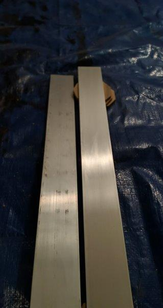
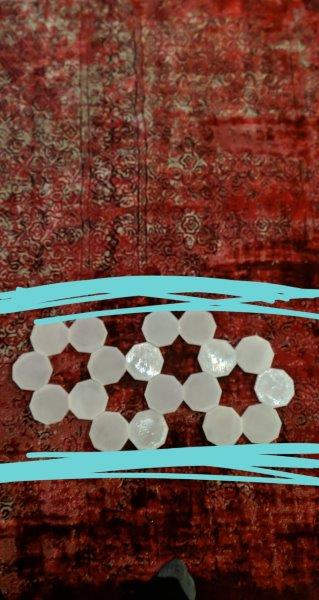
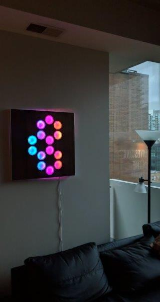
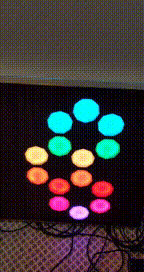

# The Nonagons
- [Introduction](#introduction)
- [Parts](#parts)
- [Tools](#tools)
- [3D Printing](#3d-printing)
- [CNC Routing](#cnc-routing)
- [Assembly](#assembly)
  * [Gluing](#gluing)
  * [Coasters](#coasters)
  * [Wiring](#wiring)
- [Software](#software)
  * [Development Environment](#development-environment)
  * [Libraries](#libraries)
  * [Architecture](#architecture)
  * [Setup](#setup)
  * [Making Patterns](#making-patterns)
- [Similar Patterns](#similar-patterns)
- [Finished Product](#finished-product)
  * [Images](#images)
  * [Gifs](#gifs)
  * [Videos](#videos)
## Introduction
The Nonagons are an art project I started back in December of 2019 to fill the space on an empty wall in my living room. I had some LEDs and an old raspberry pi laying around that were put to good use in the nonagons.
## Parts
- Raspberry Pi 2b+
- 4 144 LED/m Dotstar Strips (only 434 LEDs total used and I bought mine from adafruit but you can find them cheaper as APA102 led strips)
- Mini USB Microphone
- Female DC Power adapter - 2.1mm jack to screw terminal block
- 74AHCT125 - Quad Level-Shifter (3V to 5V)
- 10a / 5V power supply
- 40 4pin strip-to-strip LED connectors 10mm wide (these were actually not wide enough but ended up working)
- A large assortment of jumpper wires of all types
- 4700uF 10v Capacitor
- 2 feet x 2 feet x 1/4 inch project board (https://www.homedepot.com/p/Columbia-Forest-Products-3-4-in-x-2-ft-x-2-ft-PureBond-Walnut-Plywood-Project-Panel-Free-Custom-Cut-Available-2731/204771202)
- A test board with the same dimensions as above made of something cheap like MDF
- Excess wood, preferably also 1/4in thick (used for gluing to the main project board, screwing the screw eyes into and hanging from)
- 2 Screw Eyes
- Picture Hanging Wire
- Wood Stain
- Spray on Lacquer
- Gorilla Glue
- 8ft of Quarter Round (size doesn't matter a ton, it's just to increase the surface area the aluminum can be glued to)
- Slightly more than 8ft of Aluminum that is 2 inches wide (one of these and maybe another that is at least 4 ft https://www.lowes.com/pd/Steelworks-0-125-ft-x-2-in-Aluminum-Solid/3058163)
- A thin sheet of cork (optional for coasters)

## Tools
- An exacto knife preferably with a couple different attachments for different jobs
- A CNC Router (I used an x-carve with a 1/8th inch drill  bit for the whole project)
- A 3D Printer with clear filament
- Clamps
- A hacksaw with a blade for cutting metal
- Soldering Iron & Solder
- Gloves
- A Tarp 
- Something to spread wood stain with
- A respirator if you use spray on lacquer
- Sandpaper of varyings grits (Some for wood, some very fine for the aluminum pieces)

## 3D Printing
The plastic nonagons were first designed in Blender as a flat surface with walls to keep the LEDs inside. Then I printed them with transparent filament.<br>

<br>

At this point there was no plan for the board and after seeing that they managed to fit some LEDs comfortably inside, then the rest of the board was planned around their size<br>


## CNC Routing
The design for the CNC cut was created in the Inventables Easel program, it's super easy to use. There are little tails on each nonagon so that there is room for wires sticking out of each nonagon</br> 
<br>

Test cuts were made in an MDF board to get the size right holes for the plastic nonagons. I had to pause the cut and turn off the drill as soon as each nonagon was cut completely out in order to remove the cut out piece of wood. Without removing the wood the drill bit could potentially fling it across the work surface.<br>


<br>

After getting the right sized nonagon cutouts determined, it was time to move on to using actual wood.<br>
<br>

Unfortunately one of the wood boards ended up not laying as flat as the MDF and the drill went through in places it shouldn't have. Luckily I had another.<br>
<br>

The wooden cutouts are a good size for coasters so I saved them<br>
<br>
## Assembly
Somewhere along the way I realized I could only fit 31 LEDs on a strip inside the nonagons if I had plastic connectors and wires on both ends of the strip. Originally I hadn't planned to do all the LEDs in series but it was the path of least resistance. 
- In order to have the wires sit comfortably in the nonagon I needed to cut a rectangle out of the plastic nonagon walls. This seemed very difficult to do at first but a simple method I discovered was heating up my exacto knife blade and then quickly cutting/melting through the portion of the nonagon I wanted to remove.
- I removed the cover on one side of each plastic connector so that the LED strip could fit in it. I had to shave off a very small amount of the strip's sides in order to fit them into the plastic connectors.

<br><br>

Next the rough edges of the board needed to be sanded and then the board was stained. After the stain dried the board was coated several times in spray on lacquer (make sure to do this in a well ventilated area and wear a respirator)<br>


### Gluing
Throughout the gluing process I was using small clamps to hold the pieces in place and random heavy objects to hold the board flat and in place. 
Next the wooden quarter round was cut to size and glued onto the wood so that there was a larger surface area on the sides of the project board which the aluminum frame could be glued to.<br>
<br>

Next the aluminum strips were cut to size. 2 of them were 2ft exactly and the other two were 2ft and a quarter or half inch so that the aluminum could make a perfect box around the edges of the project board. The aluminum was sanded with increasingly higher grit sandpaper to remove blemishes and make it look polished.<br>

<br>

Next two rectangles of wood were glued onto the back of the main board and screw eyes were installed so that picture hanging wire could hang the whole project on the wall. The extra layer of wood was added so that the screw eyes would not pierce or warp the main board in any way.<br>
<br>

Next the aluminum edges were glued onto the board<br>
<br>

About an hour after gluing once the glue is set but not 100% dried, I flipped the project over to remove any excess glue from the front of the board while it was still ever so slightly malleable. When completely dried the glue can also be removed very carefully using an exacto knife.<br>

<br>

One of the final steps of assembling the board itself was gluing in the plastic nonagons<br>


### Coasters
The wooden cutouts from the board can be easily turned into coasters. I carved names into some of them for my girlfriend and her roommates as well as for Ken's 50th.<br>
<br>

I stained the cutouts and then sprayed them with lacquer before cutting very thin cork to glue onto the back of the coasters. Before doing this I wish I had attached something heavy to the back of the coasters because the surface tension from water can easily pick them up due to being super light. The cork cutouts are definitely just forbidden pringles.<br>


<br><br>I broke at least one exacto knife blade because I accidentally glued a couple of these to some excess MDF. The coasters work pretty well!<br>


### Wiring
<br>
Thankfully the wiring is simpler than it looks in that image. I got rid of the analog to digital converter chip and electret microphone that are pictured above. All the remains are the raspberry pi, the power sources, the strips and the level shifter. The microphone I'm using is called "Mini USB Microphone" and it's plugged into the USB port along with the WIFI adapter.
#### Power
The Raspberry Pi is being powered by it's stock usb power cable
The LED Strips are being powered separately by a 5V/10A power supply
  - Each strip of 31 LEDs is in parallel with regard to power, with power and ground coming from this supply
  - There is a capacitor also in parallel with the strips to prevent any current spikes from damaging the LEDs
  - Adafruit has great guides on [powering LEDs](https://learn.adafruit.com/adafruit-neopixel-uberguide/powering-neopixels) and [managing power draw](https://learn.adafruit.com/sipping-power-with-neopixels/insights)
#### LEDs and Raspberry Pi
I followed [this](https://learn.adafruit.com/adafruit-dotstar-leds/power-and-connections) guide on adafruit's website to wire up the LEDs. 


## Software
### Development Environment


### Libraries
- pyaudio and audioop for audio processing 
- numpy for more audio processing
- adafruit_dotstar for using the LEDs
- firebase_admin for reading and writing the firestore database which contains the state of the nonagons

### Architecture
- The main application for running animations is written in python and running on the raspberry pi.
- That connects to a firestore database for determining the state of the nonagons and to store animation modes
- The frontend is an angular app that can be found [here](https://github.com/peterbatridge/peterbatridge.github.io/tree/master/lights) and can switch modes on the nonagons from any browser.

### Setup
Here is the crontab setup to start the program in the background 30 seconds after startup. This could be modified to start immediately and then the python could check for a network connection.
```
sudo crontab -e
>
@reboot (sleep 30 && sudo python3 /home/pi/Desktop/ennea-LED/main.py) &   
>
ctrl+x > y
```

credentials.py contains something like this for the Chicago CTA API and a weather API:
```
owm_api_key = "API_KEY_HERE"
cta_api_key = "API_KEY_HERE"
```

firestore.py contains your firestore credentials

### Making Patterns


### TODO
- So so so much
- Scheduling for modes (like automatically turning off or at 8am displaying a weather mode)
- Mode Ideas:
  - Weather Mode
  - Train Passing Mode
- Engine Improvements:
    - Add Triangle Class (and also add that to expanding stuff)
    - Ensure that all modes have a way of breaking from their loop if the mode changes
    - Create random modes
        - All non-audio modes
        - All audio modes
        - Mix of audio and non audio
        - Blinding Modes?
- User Interface:
    - Add acceptable range for all parameters
    - Ensure UI can handle all types of modes
    - Allow addition of color palettes
    - Allow addition of nonagon groups 
- Bugs:
    - Some parameters aren't named correctly
    
## Similar Patterns
After making this I couldn't stop seeing similar patterns, for example:<br>



## Finished Product
### Images



### Gifs




### Videos
[](https://youtu.be/n0ZV-ptZl_Y)
[](https://youtu.be/ieBVs7NSkAc)
[](https://youtu.be/9pl_Fcg_5wQ)
[](https://youtu.be/SgAImAgqI5I)


